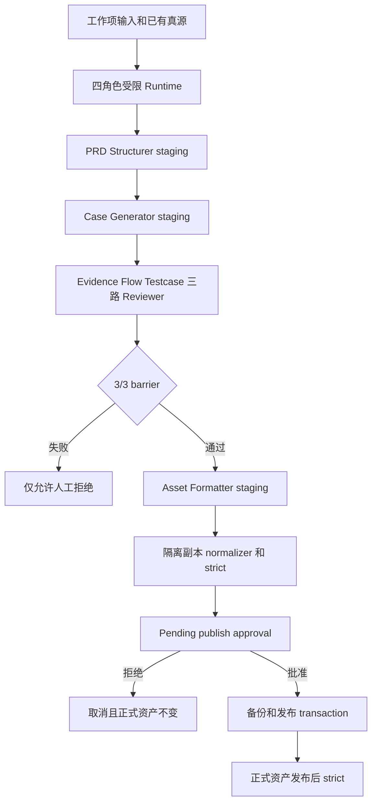
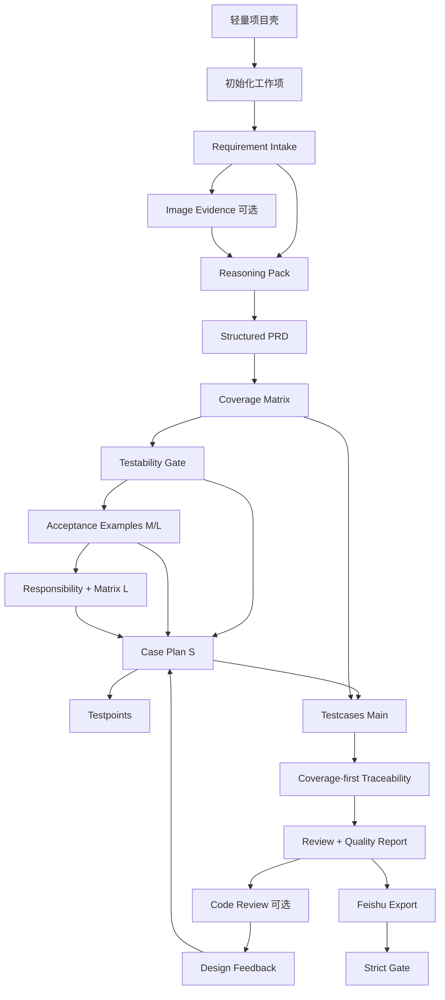

# AI 测试用例流水线实现与控制说明

本文档说明 AI Test Pipeline 从项目初始化、需求接入到测试用例交付的完整实现路径，以及 Harness-Loop 如何通过 staging、Validator、审批、事务、恢复、审计和回归门禁控制整个过程。

本文档是运行说明真源。首次使用建议先阅读本节的快速指南，再按需查阅后续阶段细节。

## 0. Harness-Loop 快速运行指南

### 0.1 先理解：现在有哪几种运行方式

Harness-Loop 不是一个始终驻留的服务，而是一组围绕工作项运行的受控命令。统一入口是：

```text
scripts/run_work_item_pipeline.py
```

根据目标选择模式：

```text
只校验现有正式资产
-> start / status / resume / audit-run

让四个 AI 角色在 staging 中生成和评审候选
-> agent-roles
-> approve-roles 或 reject-roles

只试运行 Case Plan Agent
-> agent-case-plan
-> approve-case-plan 或 reject-case-plan

使用已有 bundle 或生成器构造全链路候选
-> generate
-> approve-generation 或 reject-generation

验证 Harness 框架本身没有回退
-> run_harness_closeout.py
```

最重要的区别：

- `start` 是只读 Validator 编排，不调用模型，不生成候选，不修改正式资产。
- `agent-*` 和 `generate` 只先写 `.generation/runs/<RUN_ID>/` staging。
- staging 通过并不等于正式发布；所有正式写入都必须经过独立审批。
- `approve-*` 才可能修改正式资产，且会再次检查 hash、执行事务 journal 和发布后 strict。
- `reject-*` 会保留审计记录并取消 run，不修改正式资产。

### 0.2 当前推荐主流程



模型不能直接写工作项正式目录。角色只能通过白名单 Action 读写 run-local staging；Validator 结论高于模型判断。

### 0.3 对已有工作项做只读校验

适合以下情况：

- 只想确认现有正式产物是否仍通过。
- 修改了 Schema、Rule、Validator 或 Harness，想检查兼容性。
- 不需要调用模型或生成新测试用例。

以 PT083 为例：

```bash
RUN_ID=RUN-PT083-VALIDATE-001

/usr/bin/python3 scripts/run_work_item_pipeline.py start \
  --project-code WX-YGJ \
  --work-item-id PT083 \
  --run-id "$RUN_ID" \
  --work-item-level M \
  --strict \
  --stop-at strict_gate
```

查看状态：

```bash
/usr/bin/python3 scripts/run_work_item_pipeline.py status \
  --project-code WX-YGJ \
  --work-item-id PT083 \
  --run-id "$RUN_ID"
```

从 checkpoint 恢复只读 Orchestrator：

```bash
/usr/bin/python3 scripts/run_work_item_pipeline.py resume \
  --project-code WX-YGJ \
  --work-item-id PT083 \
  --run-id "$RUN_ID"
```

完成后审计：

```bash
/usr/bin/python3 scripts/run_work_item_pipeline.py audit-run \
  --project-code WX-YGJ \
  --work-item-id PT083 \
  --run-id "$RUN_ID"
```

成功条件：

- 命令退出码为 0。
- `run_state.json.status=completed`。
- 所有必需 stage 为 `succeeded`。
- `audit_passed=true` 且 `audit_errors=0`。

### 0.4 运行完整四角色 Harness

适合需要 AI 重新整理 PRD、生成用例、评审和格式化候选的情况。

生产运行必须提供经过人工信任的模型 adapter。Adapter 通过 stdin 接收结构化 request，通过 stdout 返回一个 Action 或 `{action, usage, runtime}` JSON envelope。

```bash
RUN_ID=RUN-PT083-ROLES-001

/usr/bin/python3 scripts/run_work_item_pipeline.py agent-roles \
  --project-code WX-YGJ \
  --work-item-id PT083 \
  --run-id "$RUN_ID" \
  --work-item-level M \
  --provider-command-json '["/absolute/path/to/trusted-role-adapter"]' \
  --parallel-reviewers \
  --max-turns-per-role 8 \
  --max-turns-per-reviewer 4 \
  --reviewer-timeout-seconds 120 \
  --max-model-calls 48 \
  --max-wall-seconds 1800 \
  --require-usage
```

四角色固定顺序：

```text
PRD Structurer
-> Case Generator
-> Case Reviewer
-> Asset Formatter
```

启用 `--parallel-reviewers` 后，Case Reviewer 内部固定并发执行：

```text
Evidence Reviewer
Flow Reviewer
Testcase Reviewer
```

只有三路全部成功才允许聚合 `review_bundle.json`、生成 `reviews/review_record.md` staging 并继续 Formatter。任一路失败都不能绕过 barrier。

正常情况下命令会停在：

```text
status: waiting_approval
current_stage: asset_formatter
```

这表示候选已通过隔离 strict，但尚未发布。

### 0.5 审批前必须检查什么

不要看到 `waiting_approval` 就直接批准。至少检查：

```text
.generation/runs/<RUN_ID>/run_state.json
.generation/runs/<RUN_ID>/role_runtime_state.json
.generation/runs/<RUN_ID>/parallel_review/runtime_state.json
.generation/runs/<RUN_ID>/parallel_review/review_bundle.json
.generation/runs/<RUN_ID>/generation_candidate.json
.generation/runs/<RUN_ID>/staging/
.generation/runs/<RUN_ID>/approvals/*.json
.generation/runs/<RUN_ID>/telemetry.json
```

重点确认：

- 四角色状态符合预期。
- 并行 Reviewer 为 3/3 succeeded。
- 没有未处理的高风险 finding。
- `generation_candidate.json` 的目标文件范围合理。
- approval 中的 candidate、target、upstream hash 未漂移。
- 候选 diff 不包含意外删除或正式真源切换。

### 0.6 批准或拒绝四角色候选

批准会实际发布正式资产，必须使用 approval 文件中的精确 ID 和 candidate hash：

```bash
/usr/bin/python3 scripts/run_work_item_pipeline.py approve-roles \
  --project-code WX-YGJ \
  --work-item-id PT083 \
  --run-id "$RUN_ID" \
  --approval-id <APPROVAL_ID> \
  --candidate-hash <CANDIDATE_SHA256> \
  --approved-by <REVIEWER>
```

只做试运行或不接受候选时使用：

```bash
/usr/bin/python3 scripts/run_work_item_pipeline.py reject-roles \
  --project-code WX-YGJ \
  --work-item-id PT083 \
  --run-id "$RUN_ID" \
  --approval-id <APPROVAL_ID> \
  --rejected-by <REVIEWER> \
  --reason "<REASON>"
```

无论批准还是拒绝，完成后都应再次运行 `audit-run`。

### 0.7 其他受控运行入口

只试运行 Case Plan Agent：

```bash
/usr/bin/python3 scripts/run_work_item_pipeline.py agent-case-plan \
  --project-code WX-YGJ \
  --work-item-id PT083 \
  --run-id <RUN_ID> \
  --work-item-level M \
  --provider-command-json '["/absolute/path/to/trusted-case-plan-adapter"]'
```

该入口只允许生成 `testcases/case_plan.json` staging，成功后使用 `approve-case-plan` 或 `reject-case-plan`。

使用当前正式资产构建受控全链路候选：

```bash
/usr/bin/python3 scripts/run_work_item_pipeline.py generate \
  --project-code WX-YGJ \
  --work-item-id PT083 \
  --run-id <RUN_ID> \
  --work-item-level M \
  --provider existing
```

接入可信生成器时改用：

```bash
--provider command \
--provider-command-json '["/absolute/path/to/trusted-generation-adapter"]'
```

候选始终先在隔离副本中执行 normalizer 和 strict，再停在审批。批准使用 `approve-generation`，拒绝使用 `reject-generation`。

### 0.8 各类中断如何处理

先查看：

```bash
/usr/bin/python3 scripts/run_work_item_pipeline.py status \
  --project-code <PROJECT_CODE> \
  --work-item-id <WORK_ITEM_ID> \
  --run-id <RUN_ID>
```

按状态处理：

```text
只读 Harness 暂停或失败
-> 修复对应 Validator 问题
-> resume

Case Plan commit transaction 为 prepared/committing
-> recover-case-plan

Generation publish transaction 为 prepared/publishing
-> recover-generation

multi_role 因进程崩溃遗留 running
-> recover-roles
-> 原 run 被安全取消
-> 使用新 RUN_ID 重新 agent-roles

waiting_approval
-> approve-* 或 reject-*
-> 不使用 recover-roles 绕过审批
```

四角色崩溃恢复示例：

```bash
/usr/bin/python3 scripts/run_work_item_pipeline.py recover-roles \
  --project-code WX-YGJ \
  --work-item-id PT083 \
  --run-id <RUN_ID> \
  --recovered-by <OPERATOR> \
  --reason "<CRASH_REASON>" \
  --force-unlock
```

`recover-roles` 不会继续模型上下文，也不会复用部分 Reviewer 结果。它只保留 staging、Action、Finding、日志和诊断，跳过未完成角色并将 run 置为 `cancelled`。业务继续执行必须创建新 run。

### 0.9 只测试框架，不调用生产模型

仓库内 fixture adapter 只用于验证 Harness 协议、并发、预算、审批和审计，不代表真实模型质量。

```bash
RUN_ID=RUN-PT083-HARNESS-TEST-001

/usr/bin/python3 scripts/run_work_item_pipeline.py agent-roles \
  --project-code WX-YGJ \
  --work-item-id PT083 \
  --run-id "$RUN_ID" \
  --work-item-level M \
  --provider-command-json \
  '["/usr/bin/python3","tests/fixtures/parallel_reviewer_adapter.py"]' \
  --parallel-reviewers \
  --max-model-calls 48 \
  --require-usage
```

该命令应运行到 pending publish approval。框架验收时应显式 `reject-roles`，证明候选不会自动发布。

### 0.10 执行 Harness-Loop 总验收

代码、Schema、Rule、Hook、Runtime 或恢复逻辑变化后执行：

```bash
/usr/bin/python3 scripts/run_harness_closeout.py \
  --project-code WX-YGJ \
  --work-item-id PT083 \
  --work-item-level M
```

Closeout 会依次执行：

```text
确定性 Harness
-> Run Audit
-> Golden Eval
-> Quality Baseline
-> 正式资产前后指纹比较
```

必须同时满足：

- `result: PASS`
- `formal_assets_unchanged: True`
- deterministic Harness、audit、golden、quality baseline 全部 PASS

Golden 与质量基线也可独立运行：

```bash
/usr/bin/python3 scripts/run_eval_suite.py --tier golden
/usr/bin/python3 scripts/run_quality_baseline.py
```

### 0.11 Run 产物在哪里

每个 run 的过程状态都位于：

```text
assets/projects/<PROJECT_CODE>/work_items/<WORK_ITEM_ID>/
└── .generation/
    ├── current_run.json
    └── runs/<RUN_ID>/
        ├── run_state.json
        ├── events.jsonl
        ├── diagnostics/
        ├── logs/
        ├── actions/
        ├── approvals/
        ├── telemetry.json
        ├── run_summary.json
        ├── audit_report.json
        ├── role_runtime_state.json
        ├── role_workspace/
        ├── parallel_review/
        ├── generation_candidate.json
        ├── publish_transaction.json
        ├── case_plan_commit_transaction.json
        └── multi_role_recovery.json
```

这些都是运行过程、审批、恢复和审计证据，不是业务真源。

正式测试资产仍位于工作项标准目录：

```text
structured_prd/
acceptance/
design/
testcases/
traceability/
reviews/
```

### 0.12 日常推荐操作顺序

已有工作项日常检查：

```text
1. start --strict --stop-at strict_gate
2. audit-run
3. 查看 diagnostics / logs
4. 不需要生成时到此结束
```

需要 AI 重新生成候选：

```text
1. 准备可信 adapter 与预算
2. agent-roles --parallel-reviewers
3. 查看 role staging、Reviewer findings、candidate 和 diff
4. 人工 approve-roles 或 reject-roles
5. audit-run
6. run_harness_closeout.py
```

Harness 变更后的发布前检查：

```text
1. 专项单元测试
2. 全量 unittest
3. golden eval
4. PT083 fixture dry-run 并显式拒绝
5. closeout
6. run_quality_baseline.py
```

## 1. 核心原则

流水线不允许模型直接执行：

```text
PRD -> Testcases
```

正式链路为：

```text
项目/工作项初始化
-> Requirement Intake
-> Reasoning
-> Structured PRD
-> Coverage Planning
-> Testability Gate
-> Acceptance Examples
-> Responsibility / Test Design Matrix
-> Case Plan
-> Testpoints + Testcases
-> Traceability
-> Review / Code Review
-> Export
-> Strict Gate
```

核心真源：

```text
structured_prd/structured_prd.md
testcases/case_plan.json
testcases/testcases_main.md
traceability/coverage_first_traceability.json
reviews/quality_report.json
```


## 2. 统一控制模型

每个阶段都通过以下机制控制：

```text
流程契约
-> Skill 执行规范
-> Prompt / Template
-> Schema / Rules
-> 生成与校验脚本
-> Strict Gate
```


### 2.1 流程契约

核心文件：

```text
AGENTS.md
START_HERE.md
WORKFLOW_CONTRACT.md
```

负责定义：

- 阶段顺序
- Agent 角色
- 输入输出路径
- S/M/L 策略
- 真源与兼容层
- 禁止行为
- 最终交付条件


### 2.2 Skill

目录：

```text
skills/<stage>/
```

Skill 规定：

- 本阶段读取什么
- 如何理解输入
- 输出什么产物
- 哪些内容禁止生成
- 使用哪个模板和规则
- 生成后运行哪个 validator

Skill 是 AI 的执行规程，不是独立常驻进程。

### 2.3 Prompt 与 Template

```text
prompts/
skills/*/templates/
```

Prompt 控制模型的任务目标和语义边界；Template 控制 Markdown/JSON 的标准骨架。

### 2.4 Schema 与 Rules

```text
schemas/
rules/
skills/numbering-tagging/rules/
```

Schema 控制：

- 必填字段
- 数据类型
- 枚举值
- ID 格式
- 引用关系

Rules 控制：

- 字段必填证据
- 单规则单断言
- 页面和板块分组
- 元素标注
- 人工可读表达
- 编号、标签和优先级


### 2.5 Script 与 Validator

确定性工作由 `scripts/` 或 `skills/*/scripts/` 执行：

- 单 Skill 产物校验放在 `skills/<skill>/scripts/`
- 跨阶段映射、兼容投影和总门禁放在根 `scripts/`


### 2.6 Strict Gate

正式交付入口：

```bash
python3 scripts/validate_work_item.py \
  --project-code <PROJECT_CODE> \
  --work-item-id <WORK_ITEM_ID> \
  --strict
```

模型不能自行宣布通过；最终以脚本退出码为准。

## 3. 总体流程图




## 4. 阶段 0：轻量项目壳

入口：

```bash
python3 scripts/init_project.py \
  --project-code <PROJECT_CODE> \
  --project-name <PROJECT_NAME> \
  --business-line <BUSINESS_LINE>
```

标准输出：

```text
assets/projects/<PROJECT_CODE>/
├── README.md
├── project_manifest.json
├── inputs/common/
├── indexes/
├── reports/
├── knowledge/
└── work_items/
```

控制方式：

- `project_manifest.schema.json` 定义项目静态元数据
- `asset_model` 固定为 `work_item_truth`
- 项目根不允许出现正式 structured PRD、testcase、traceability 或 review 真源
- 项目索引和汇总只能从工作项再生，不得反写

项目视图：

```bash
python3 scripts/refresh_project_views.py --project-code <PROJECT_CODE>
python3 scripts/validate_project.py --project-code <PROJECT_CODE> --strict
```


## 5. 阶段 1：工作项初始化

入口：

```bash
python3 scripts/create_work_item.py \
  --project-code <PROJECT_CODE> \
  --work-item-id <WORK_ITEM_ID> \
  --work-item-level M
```

标准输出：

```text
work_items/<WORK_ITEM_ID>/
├── manifest.json
├── inputs/
├── image_evidence/
├── analysis/
├── evidence/
├── structured_prd/
├── coverage/
├── acceptance/
├── design/
├── testcases/
├── traceability/
├── reviews/
└── code_reviews/
```

档位解析：

```text
CLI --work-item-level
> manifest.json.work_item_level
> project_manifest.default_work_item_level
> 默认 M
```

初始化状态：

```text
manifest.status = initialized
```

Non-strict 可允许占位产物；strict 必须阻止空模板进入正式交付。

## 6. 阶段 2：需求接入与归一化

Skill：

```text
skills/requirement-summary/
```

输入：

- PRD
- 飞书或其他文档
- 原型链接
- PDF
- 截图
- 补充说明
- 项目级公共输入

标准输出：

```text
inputs/requirement_summary.md
inputs/source_manifest.json
```

控制要求：

- 保留原始输入
- 区分确认需求、推断、风险和待确认问题
- `source_manifest` 记录实际消费来源及访问状态
- 本阶段不得生成 structured PRD、Case Plan 或 Testcase

校验：

```bash
python3 skills/requirement-summary/scripts/validate_requirement_sources.py \
  --input <source_manifest.json> \
  --strict
```


## 7. 阶段 3：图片证据抽取

Skill：

```text
skills/prd-image-evidence-extractor/
```

输入：

```text
inputs/images/
```

标准输出：

```text
image_evidence/image_evidence_inventory.json
```

控制要求：

- 页面、板块、字段、按钮、弹窗、说明表逐项抽取
- 明确证据与视觉推断分离
- 无法识别内容标记待确认
- 纯文本需求不要求 image evidence

校验：

```bash
python3 skills/prd-image-evidence-extractor/scripts/validate_image_evidence.py \
  --input <image_evidence_inventory.json>
```


## 8. 阶段 4：Reasoning Analysis

Skill：

```text
skills/reasoning-analysis/
```

输入：

```text
requirement_summary.md
source_manifest.json
image_evidence 可选
received_screenshots.md 可选
```

标准输出：

```text
analysis/reasoning_pack.json
analysis/analysis_report.md
```

`reasoning_pack` 包含：

- explicit rules
- implicit rules
- field constraints
- data source rules
- business risks
- edge cases
- ambiguities
- recommended test dimensions
- coverage candidates

控制要求：

- requirement summary 明确进入 reasoning
- 来源清单进入 provenance
- 明确规则与 AI 推断分离
- 纯文本需求不得因缺少图片失败

校验：

```bash
python3 skills/reasoning-analysis/scripts/validate_reasoning_pack.py \
  --input <reasoning_pack.json> \
  --schema schemas/reasoning_pack.schema.json
```


## 9. 阶段 5：Structured PRD

Skill：

```text
skills/prd-structuring/
```

输入：

```text
requirement_summary
reasoning_pack
原始 inputs
image_evidence 可选
```

标准输出：

```text
structured_prd/structured_prd.md
structured_prd/structured_prd.json
evidence/evidence_inventory.json
```

真源关系：

```text
structured_prd.md = authoring truth
structured_prd.json = compiled machine projection
```

控制要求：

- 字段和规则原子化
- 条件展示进入 `visible_when`
- 条件必填进入 `required_when`
- 编辑权限进入 `editable_when / readonly_when`
- 边界进入 `min / max / max_length / max_count`
- 数据源进入 `filter / display / order_by`
- 页面和板块上下文持续保留

编译与校验：

```bash
python3 scripts/compile_structured_prd_json.py
python3 skills/prd-structuring/scripts/validate_structured_prd.py
python3 scripts/validate_image_evidence_mapping.py
```


## 10. 阶段 6：Coverage Planning

Skill：

```text
skills/coverage-planning/
```

输入：

```text
structured_prd.json
reasoning_pack.json
```

标准输出：

```text
coverage/coverage_matrix.json
```

Coverage 分类：

- field property
- required
- conditional required
- conditional visibility
- conditional editability
- value boundary
- invalid input
- data source filter/display/order
- happy path combination

控制字段：

```text
coverage_level
emit_mode
source_origin
structured_refs
reasoning_refs
```

校验：

```bash
python3 skills/coverage-planning/scripts/validate_coverage_matrix.py
```


## 11. 阶段 7：Testability Gate

Skill：

```text
skills/testability-gate/
```

标准输出：

```text
acceptance/testability_gate.md
acceptance/testability_gate.json
```

分类：

- product acceptance
- soft prompt
- technical background
- risk/API guard
- needs confirmation
- out of scope

控制要求：

- 每条 Gate 关联 source rule
- soft prompt 不得升级为 hard block
- technical background 不得生成业务用例
- 待确认规则不得进入正式生成


## 12. 阶段 8：Acceptance Examples

Skill：

```text
skills/acceptance-example/
```

适用档位：

```text
M / L 必需
S 可省略
```

标准输出：

```text
acceptance/acceptance_examples.md
acceptance/acceptance_examples.json
```

标准结构：

```text
Given
When
Then
verification_side
oracle_strength
source_gate_ids
```


## 13. 阶段 9：Responsibility 与 Test Design Matrix

Skill：

```text
skills/test-design/
```

适用档位：

```text
L 必需
```

标准输出：

```text
design/verification_responsibility_map.md/json
design/test_design_matrix.md/json
```

控制内容：

- B 端、C 端、API、服务端责任分离
- Risk/API Guard 与主验收分池
- Gate、Example、Responsibility、Case Plan 引用闭环
- 所有正式 Case Plan 被 Matrix 覆盖


## 14. 阶段 10：Case Plan

标准输出：

```text
testcases/case_plan.md
testcases/case_plan.json
```

每条计划包含：

```text
case_plan_id
source_gate_ids
source_example_ids
source_responsibility_ids
source_coverage_ids
generated_testcase_ids
verification_side
case_type
assertion
validation_path
should_generate_case
```

控制要求：

- S 追溯 Gate
- M 额外追溯 Example
- L 额外追溯 Responsibility/Matrix
- `should_generate_case=true` 必须有 Coverage 或稳定 Testcase 映射
- Risk/API Guard 不得混入主验收


## 15. 阶段 11：Testpoints 与 Testcases

Skill：

```text
skills/case-generation/
skills/numbering-tagging/
```

同轮输出：

```text
testcases/testpoints.md
testcases/testpoints.json
testcases/testcases_main.md
```

Testpoints 控制：

- 以 Case Plan 为来源
- 可从主用例补充页面和板块
- `projection_only=true`
- 不反写 Case Plan

Testcase 控制：

- 单规则单核心断言
- 每条用例关联 CasePlan ID
- 按页面 + 板块分表
- 正文使用统一元素标注
- 标题、步骤、预期人工可读
- 编号、标签、优先级按 YAML 规则生成

保护策略：

- 活跃 Case Plan 但 Coverage 为空时硬失败
- Case Plan 无法匹配候选用例时硬失败
- 禁止 0 条结果覆盖正式 `testcases_main.md`


## 16. 阶段 12：派生产物刷新

Bundle 写入后固定执行：

```text
Structured PRD 编译/渲染
-> Testpoints
-> Dev Self Testcases
-> Testcase Bundle
-> Coverage-first Traceability
-> Traceability Adapter / Legacy Slim
-> Review Scorer / Quality Report
-> Feishu Export
-> Unified Validation
```

派生产物：

```text
testcases/testcases.md
testcases/dev_self_testcases.md
testcases/testcase_bundle.json
testcases/field_audit.json
testcases/grouped_audit.json
traceability/traceability_adapter.json
```

这些产物不得反写真源。

## 17. 阶段 13：Traceability

标准输出：

```text
traceability/coverage_first_traceability.json
traceability/traceability_adapter.json
traceability/traceability_matrix.json
```

主追溯关系：

```text
evidence
-> structured rule
-> coverage
-> gate
-> case plan
-> testcase
```

控制要求：

- Coverage-first 文件是追溯真源
- Adapter 是兼容投影
- Legacy Matrix 只用于历史对照
- 无效引用和伪追溯必须失败


## 18. 阶段 14：Review 与 Quality Report

Skill：

```text
skills/review-gate/
```

标准输出：

```text
reviews/review_record.md
reviews/quality_report.json
reviews/missing_rules.json
reviews/weak_cases.json
reviews/generalized_cases.json
reviews/duplicate_case_report.json
```

质量指标：

- 正式用例数量
- 原子用例率
- 边界覆盖率
- 数据源规则覆盖率
- 泛化用例率
- 重复用例率
- Traceability 失真率
- Field/Grouped Audit 统计

Quality Report 保存以下主产物 SHA-256：

```text
structured_prd
coverage_matrix
testcases_main
coverage_first_traceability
```

主产物变化但报告未刷新时，校验失败。

## 19. 阶段 15：Code Review 映证

标准输出：

```text
code_reviews/frontend_code_review.md
code_reviews/backend_code_review.md
code_reviews/frontend_confirmation.json
code_reviews/backend_confirmation.json
design/design_feedback.json
design/unmapped_code_review_findings.json
```

控制要求：

- 仅 confirmation 为 confirmed 的 Findings 可转 Design Feedback
- Finding 必须映射 CasePlan
- 无法映射的 Finding 单独进入 unmapped 文件
- Design Feedback 只能修改测试设计层
- 禁止直接覆盖正式 Testcase


## 20. 阶段 16：最终 Strict Gate

入口：

```bash
python3 scripts/validate_work_item.py \
  --project-code <PROJECT_CODE> \
  --work-item-id <WORK_ITEM_ID> \
  --strict
```

串联检查：

```text
Manifest / Work Item Level
Requirement Intake
Structured PRD
Testability / Acceptance / Design
Case Plan
Testpoints / Testcases
Traceability
Quality Report
Review Gate
Code Review
```

初始化状态与正式交付状态应区分：

```text
initialized + non-strict -> 允许占位，输出 warning
initialized + strict -> 阻止交付
正式资产 + strict -> 执行完整门禁
```


## 21. S/M/L 策略

```text
S:
testability_gate
-> case_plan
-> testpoints + testcases

M:
testability_gate
-> acceptance_examples
-> case_plan
-> testpoints + testcases

L:
testability_gate
-> acceptance_examples
-> verification_responsibility_map
-> test_design_matrix
-> case_plan
-> testpoints + testcases
```

档位来源：

```text
CLI override
> work-item manifest
> project manifest default
> M
```

生成、Bundle 和最终校验必须使用同一有效档位。

## 22. 重跑与修复

生成任务包：

```bash
python3 scripts/prepare_regeneration_run.py \
  --project-code <PROJECT_CODE> \
  --work-item-id <WORK_ITEM_ID>
```

任务包包含：

```text
Preflight
Requirement Intake
Reasoning
PRD Structurer
Coverage Planner
Testability Gate
Acceptance Examples
Test Design
Case Plan
Case Generator
Reviewer
Frontend/Backend CR
Formatter
```

修复策略：

- 失败后仅做与错误直接相关的最小修改
- 最多两轮 repair
- 不降低规则强度
- 两轮后仍失败则写入 `HUMAN_ACTION_REQUIRED.md`


## 23. 项目级索引与汇总

工作项校验成功后刷新：

```bash
python3 scripts/refresh_project_views.py \
  --project-code <PROJECT_CODE>
```

标准输出：

```text
indexes/work_item_index.json
indexes/testcase_index.json
indexes/risk_index.json
reports/project_quality_summary.json
reports/project_quality_summary.md
```

项目级视图只保存摘要、状态和源路径，不复制正式产物。

项目校验：

```bash
python3 scripts/validate_project.py \
  --project-code <PROJECT_CODE> \
  --strict \
  --validate-work-items
```


## 24. 标准输出判定

一个阶段的标准输出必须同时满足：

1. 路径符合流程契约。
2. 结构符合 Template/Schema。
3. 内容符合 Rules。
4. 引用能够回到上游真源。
5. 阶段 Validator 通过。
6. 不包含未允许的占位符。
7. 下游能真实消费或明确标记为终端/派生物。

只有所有必需阶段通过 `validate_work_item.py --strict`，该工作项才可正式交付。

## 25. 当前已知边界

PT083 当前为迁移后的 M 档正式样本：82 条 Coverage、62 条 Gate、75 条 Acceptance/Case Plan/Testcase/Testpoint/Bundle、25 条开发自测，37 条唯一 main Coverage 追溯且 invalid=0。

当前保护策略：

- 继续保留 18 条正式用例真源
- 规则生成器遇到空 Coverage 或无 CasePlan 映射时硬失败
- 未经人工评审不得使用候选用例覆盖正式用例
- 该事项记录在 `docs/roadmap/HUMAN_ACTION_REQUIRED.md`

