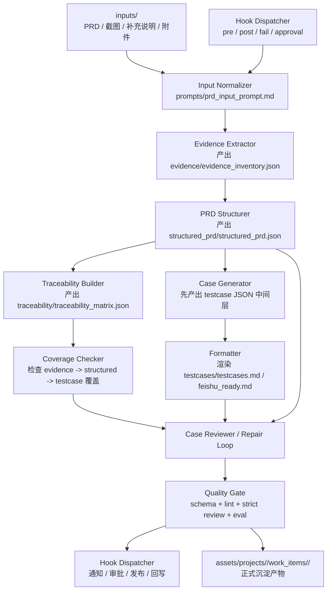

# Target Architecture And Roadmap

本文档基于当前仓库现状，给出一版可落地的目标架构图与分阶段改造清单。

说明：

- 这是历史路线文档，保留了部分阶段性旧口径
- 当前正式流程口径以 `START_HERE.md` 与 `WORKFLOW_CONTRACT.md` 为准
- 文中若出现 `testcases.md` 或 `traceability_matrix.json` 的单一真源表述，应按历史阶段口径理解

目标不是一次性把仓库重写成复杂 Agent 平台，而是按业界成熟实践，先补齐可信执行层，再补齐编排层，最后补齐规模化能力。

适用范围：

- `assets/` 下项目级与工作项级产物
- `prompts/`、`schemas/`、`skills/`、`scripts/` 的现有目录
- `AGENTS.md` 中定义的 4 个角色
- 后续 CI / 平台化接入

---

## 一、目标判断

当前仓库的优势是：

- 已有明确中间语义层：`structured_prd`
- 已有角色分工：`PRD Structurer / Case Generator / Case Reviewer / Asset Formatter`
- 已有质量门雏形：`validate_structured_prd.py / testcase_lint.py / review_gate.py`
- 已有可追溯资产：`evidence_inventory.json / traceability_matrix.json / review_record.md`

当前仓库的主要短板是：

- 仍偏规则仓，缺少稳定的运行时编排
- 输出约束偏重 prompt 与 lint，运行时强约束不足
- `testcase` 与 `review_record` 缺少正式 schema 契约
- 项目级与工作项级质量门口径不完全一致
- 缺少 eval / regression / CI 级回归能力

因此目标架构应分三层建设：

1. 可信层：schema、structured outputs、strict gate、traceability、eval
2. 编排层：角色编排、repair loop、阶段路由、产物落盘
3. 扩展层：hook、人工介入点、外部系统对接
4. 规模层：并行、观测、缓存、CI、平台化接入

---

## 二、目标架构图



设计原则：

- 模型先产出结构化中间层，再渲染 Markdown
- 每一阶段都有明确输入、输出、校验与失败重试
- `evidence -> structured_prd -> testcase` 必须双向可追溯
- reviewer 不只做格式检查，还要做覆盖与逻辑完整性检查
- hook 不承载核心业务真源，只承载扩展动作、审批、通知、同步与外部集成

---

## 三、目标目录映射

在尽量复用现有目录的前提下，建议目标职责如下。

| 目录 | 当前职责 | 目标职责 |
|---|---|---|
| `assets/` | 项目级 / 工作项级产物沉淀 | 保持不变，继续作为最终落盘目录 |
| `prompts/` | 单阶段提示词模板 | 保留，但只承载阶段性 prompt，不再承担全部业务规则 |
| `schemas/` | 部分结构定义 | 成为所有中间产物与最终产物的唯一契约源 |
| `skills/` | 角色说明与局部脚本 | 成为角色能力说明、review checklist、局部修复策略入口 |
| `scripts/` | 初始化与校验脚本 | 扩展为 pipeline orchestration、render、strict gate、eval 入口 |
| `hooks/` | 当前缺失 | 新增生命周期 hook 定义、事件配置、适配器脚本 |
| `docs/` | 架构、SOP、试运行方案 | 增加目标架构、改造路线、CI 接入规范 |
| `tool_adapters/` 与宿主私有目录 | 规则 / runtime / MCP 适配 | 后续用于不同 agent runtime 接入与角色路由 |
| `tests/` | 当前缺失 | 新增 regression、fixture、golden set、eval case |

---

## 四、Hook 能力设计

hook 的目标不是替代主流程，而是给主流程提供稳定的扩展点。

适合通过 hook 承接的能力：

- 阶段开始前的环境准备
- 阶段完成后的产物同步
- 失败后的通知与问题单创建
- 人工审批与放行
- 外部系统回写
- 观测、日志、审计留痕

不适合通过 hook 承接的能力：

- `structured_prd` 真源生成
- testcase 真源生成
- schema 主校验逻辑
- traceability 主计算逻辑

原因：

- hook 应是可插拔扩展点
- 真源生成与主校验必须稳定、可预测、可回归
- 一旦把核心业务逻辑塞进 hook，会导致流程漂移与排障困难

### 1. Hook 事件模型

建议围绕工作项生命周期定义标准事件。

#### 输入阶段

- `before_input_normalize`
- `after_input_normalize`
- `input_normalize_failed`

#### Evidence 阶段

- `before_evidence_extract`
- `after_evidence_extract`
- `evidence_extract_failed`

#### Structured PRD 阶段

- `before_structured_prd_generate`
- `after_structured_prd_generate`
- `structured_prd_generate_failed`

#### Traceability 阶段

- `before_traceability_generate`
- `after_traceability_generate`
- `traceability_generate_failed`

#### Testcase 阶段

- `before_testcase_generate`
- `after_testcase_generate`
- `testcase_generate_failed`

#### Review 阶段

- `before_review`
- `after_review`
- `review_failed`

#### 渲染与发布阶段

- `before_render`
- `after_render`
- `before_publish`
- `after_publish`
- `publish_failed`

#### 统一质量门阶段

- `before_quality_gate`
- `after_quality_gate`
- `quality_gate_failed`

### 2. Hook 类型

建议统一支持以下几类 hook。

#### Pre Hook

在阶段执行前运行。

典型用途：

- 校验环境变量
- 拉取配置
- 预生成上下文

#### Post Hook

在阶段成功后运行。

典型用途：

- 发送通知
- 回写飞书/项目管理系统
- 产物归档

#### Fail Hook

在阶段失败后运行。

典型用途：

- 创建缺陷单
- 发送告警
- 沉淀失败上下文

#### Approval Hook

在进入关键节点前阻塞等待人工确认。

典型用途：

- Review Gate 放行
- 发布前确认
- 高风险需求人工签收

#### Repair Hook

在失败后决定是否进入 repair loop，以及给 repair loop 注入额外上下文。

典型用途：

- 自动收集 lint 报错
- 汇总 review 问题
- 选择修复策略

### 3. Hook 执行契约

为了避免 hook 失控，建议明确执行契约。

每个 hook 应收到统一上下文对象，至少包含：

- `project_code`
- `work_item_id`
- `stage`
- `event`
- `status`
- `artifact_paths`
- `summary`
- `errors`
- `timestamp`

建议以 JSON 文件或标准输入传递上下文。

hook 执行约束建议：

- 必须声明读写范围
- 默认只读，写操作需显式声明
- 必须可重试或幂等
- 必须有超时限制
- 默认失败不影响主流程，除非显式配置为 blocking

### 4. Hook 配置落点

建议新增顶层目录：

```text
hooks/
├── README.md
├── global_hooks.yaml
├── adapters/
│   ├── notify_feishu.py
│   ├── create_ticket.py
│   ├── sync_report.py
│   └── approval_gate.py
└── project_templates/
```

同时支持项目级覆盖：

```text
assets/projects/<PROJECT_CODE>/hooks/
└── project_hooks.yaml
```

建议配置优先级：

1. 工作项 manifest 显式指定
2. 项目级 `project_hooks.yaml`
3. 全局 `hooks/global_hooks.yaml`

### 5. Hook 与现有目录的关系

- `scripts/` 负责主流程与 hook dispatcher
- `hooks/` 负责 hook 配置与适配器实现
- `assets/projects/.../manifest.json` 负责记录工作项级 hook 开关与例外配置
- `reviews/` 负责沉淀人工 hook 触发后的 review 结论

### 6. Hook 的建议应用场景

建议优先落 4 类 hook。

#### 质量门通知 Hook

当 `validate_work_item.py` 或 `review_gate.py` 成功或失败时：

- 成功通知协作者
- 失败回传问题摘要

#### 人工放行 Hook

在 `Review Gate` 通过后但正式沉淀前：

- 等待测试负责人或需求负责人确认

#### 外部同步 Hook

在 `after_render` 或 `after_publish`：

- 同步飞书文档
- 同步测试平台
- 同步项目管理系统

#### Repair Loop Hook

在 `quality_gate_failed`：

- 自动生成修复上下文
- 汇总 lint 与 review 错误
- 交给 `run_repair_loop.py`

### 7. Hook 需要避免的问题

- 把主流程逻辑藏进 hook
- 让 hook 直接改写真源却不留痕
- hook 无超时、无重试、无隔离
- hook 失败导致主流程行为不可预测
- 不同项目各写一套私有 hook，导致无法统一回归

---

## 五、目标产物契约

### 1. 继续保留的正式产物

- `evidence/evidence_inventory.json`
- `structured_prd/structured_prd.json`
- `traceability/traceability_matrix.json`
- `testcases/testcases.md`
- `reviews/review_record.md`
- `feishu_ready.md`

### 2. 建议新增的中间产物

为避免模型直接输出最终 Markdown，建议新增：

- `testcases/testcase_bundle.json`
- `reviews/review_record.json`

建议放置路径：

- `assets/projects/<PROJECT_CODE>/work_items/<WORK_ITEM_ID>/testcases/testcase_bundle.json`
- `assets/projects/<PROJECT_CODE>/work_items/<WORK_ITEM_ID>/reviews/review_record.json`

说明：

- `testcase_bundle.json` 作为用例唯一真源
- `testcases.md` 只是渲染结果
- `review_record.json` 作为 review 结构化真源
- `review_record.md` 只是展示与协作格式

---

## 六、目标角色编排

直接对应 `AGENTS.md` 中的 4 个角色。

### 1. PRD Structurer

输入：

- `inputs/`
- 输入整理文本
- `evidence_inventory.json`

输出：

- `structured_prd.json`

硬约束：

- 只能输出满足 schema 的 JSON
- `module_name / feature_name / flow` 必须可映射
- 不能静默丢失截图中的关键入口与元素

### 2. Case Generator

输入：

- `structured_prd.json`
- `traceability_matrix.json`

输出：

- `testcase_bundle.json`

硬约束：

- 先生成 JSON 行对象，不直接生成 Markdown
- 每条用例都必须可映射到结构化来源
- 必须同时覆盖单点用例与流程型用例

### 3. Case Reviewer

输入：

- `structured_prd.json`
- `traceability_matrix.json`
- `testcase_bundle.json`
- `review_record.json`

输出：

- review 结论
- 修复建议
- 必要时触发 repair loop

硬约束：

- 不只看格式，还要看覆盖、歧义、漏项、重复、流程闭环
- review 失败时必须给出结构化问题项

### 4. Asset Formatter

输入：

- `testcase_bundle.json`
- `review_record.json`

输出：

- `testcases.md`
- `review_record.md`
- `feishu_ready.md`

硬约束：

- Formatter 只做格式整理，不改业务语义
- Markdown 与飞书稿必须来自结构化真源渲染

---

## 七、脚本目标拆分

建议在 `scripts/` 下逐步补齐以下入口。

### 1. 初始化类

保留并修正：

- `scripts/init_project.py`
- `scripts/create_work_item.py`

需要补充：

- 初始化时同步生成 `testcase_bundle.json` 占位文件
- 初始化时同步生成 `review_record.json` 占位文件
- 初始化模板命名与校验规则统一

### 2. 生成类

建议新增：

- `scripts/run_input_normalizer.py`
- `scripts/run_evidence_extraction.py`
- `scripts/run_structured_prd_generation.py`
- `scripts/run_traceability_generation.py`
- `scripts/run_testcase_generation.py`
- `scripts/run_review_generation.py`

### 3. 渲染类

建议新增：

- `scripts/render_testcases_markdown.py`
- `scripts/render_review_record_markdown.py`
- `scripts/render_feishu_ready.py`

说明：

- 可逐步吸收现有 `export_feishu_ready.py` 的逻辑

### 4. 编排类

建议新增：

- `scripts/run_work_item_pipeline.py`
- `scripts/run_repair_loop.py`
- `scripts/run_hook_dispatcher.py`

职责：

- 串联阶段执行顺序
- 处理阶段失败后的修复重试
- 统一产物落盘与日志输出
- 在标准事件点触发 hook

### 5. 校验类

保留并增强：

- `skills/prd-structuring/scripts/validate_structured_prd.py`
- `skills/case-generation/scripts/testcase_lint.py`
- `skills/review-gate/scripts/review_gate.py`
- `scripts/validate_traceability_assets.py`
- `scripts/validate_project.py`
- `scripts/validate_work_item.py`

建议新增：

- `scripts/validate_review_record.py`
- `scripts/validate_testcase_bundle.py`
- `scripts/run_eval_suite.py`

---

## 八、Schema 改造目标

`schemas/` 目录需要从“部分定义”升级为“唯一契约源”。

### 必做项

1. 补齐 `schemas/testcase.schema.json`
2. 新增 `schemas/testcase_bundle.schema.json`
3. 新增 `schemas/review_record.schema.json`
4. 明确 `structured_prd.schema.json` 中关键字段的空值策略
5. 明确 `evidence` 与 `traceability` 的覆盖级别与缺口表达

### 建议项

建议为 `evidence_inventory.json` 增加以下字段：

- `source_type`
- `source_anchor`
- `confidence`
- `unresolved_reason`

建议为 `traceability_matrix.json` 增加以下字段：

- `structured_path`
- `coverage_reason`
- `review_status`

这样后续 review 才能真正判断：

- 是模型没识别到
- 还是结构化没承接到
- 还是 testcase 没覆盖到

---

## 九、质量门目标

### 1. 分层质量门

建议明确分成 3 档。

#### Draft Gate

适用场景：

- 初始化后
- 首轮生成后

允许：

- 占位文件存在
- 结构未完全补齐
- review 未完成

#### Review Gate

适用场景：

- 进入正式评审
- 需求资产准备交付

要求：

- `structured_prd.json` 通过 schema 与业务规则
- `traceability_matrix.json` 可闭环
- `testcase_bundle.json` 与 `testcases.md` 同步通过
- 至少存在真实 testcase 数据
- 至少存在流程型用例
- `review_record` 必须完整

#### CI Gate

适用场景：

- MR / CI / 提交前检查

要求：

- Review Gate 全通过
- eval regression 无关键回退
- 关键项目 fixture 无回归

### 2. 当前脚本需要调整的点

- `testcase_lint.py` 增加 `--strict`
- `review_gate.py` 增加对 `review_record` 的正式校验
- `validate_project.py` 提供轻量项目壳与派生索引 strict 校验
- `validate_work_item.py` 默认保留宽松模式，但提供严格模式给 CI

---

## 十、Eval 与 Regression 目标

当前仓库最缺的是可重复评测能力，因此建议正式引入 `tests/`。

### 建议目录

```text
tests/
├── fixtures/
│   ├── prd_inputs/
│   ├── evidence/
│   ├── structured_prd/
│   ├── testcase_bundle/
│   └── review_record/
├── evals/
│   ├── smoke/
│   ├── regression/
│   └── golden/
└── test_scripts/
```

### 首批必建评测集

1. PRD 抽取召回
2. Flow 完整性
3. 证据映射完整性
4. testcase 去重与覆盖
5. AI-API 候选识别
6. repair loop 修复成功率

### 评测通过标准

- 核心 golden case 不回退
- 结构化字段缺失率可量化
- Flow 主链路覆盖率可量化
- testcase 重复率与漏项率可量化

---

## 十一、分阶段改造清单

下面的阶段设计遵循：

- 先可信
- 再编排
- 后规模化

### Phase 1：补齐可信契约

目标：

- 让当前仓库从“规则存在”升级成“规则真生效”

改造范围：

- `schemas/`
- `skills/prd-structuring/scripts/validate_structured_prd.py`
- `skills/case-generation/scripts/testcase_lint.py`
- `skills/review-gate/scripts/review_gate.py`
- `scripts/validate_project.py`
- `scripts/validate_work_item.py`
- `scripts/init_project.py`
- `scripts/create_work_item.py`

任务清单：

1. 补齐 `schemas/testcase.schema.json`
2. 新增 `schemas/review_record.schema.json`
3. 新增 `schemas/testcase_bundle.schema.json`
4. `validate_structured_prd.py` 在缺少 `jsonschema` 时直接失败，不允许静默跳过
5. 持续保持 `review_record` 模板字段命名统一，统一使用“问题清单”
6. 以 `validate_project.py` 校验项目壳，以 `validate_work_item.py` 校验正式工作项
7. `testcase_lint.py` 在 strict 模式下禁止空模板通过
8. `review_gate.py` 正式接入 `review_record` 校验

验收标准：

- 项目级与工作项级校验口径一致
- 关键 schema 缺失或依赖缺失时明确失败
- strict 模式下无法用空模板通过质量门

### Phase 2：引入结构化中间产物

目标：

- 不再让模型直接产最终 Markdown

改造范围：

- `schemas/`
- `scripts/`
- `prompts/`
- `assets/`

任务清单：

1. 定义 `testcase_bundle.json` 结构
2. 定义 `review_record.json` 结构
3. 新增 Markdown 渲染脚本
4. 改造 `export_feishu_ready.py`，让其基于 JSON 真源渲染
5. 更新 prompt，使 Case Generator 输出 JSON 行对象
6. 更新校验脚本，优先校验 JSON 真源再校验 Markdown 渲染结果

验收标准：

- `testcases.md` 与 `review_record.md` 可由 JSON 真源稳定重建
- 变更格式时无需修改模型生成逻辑

### Phase 3：补齐最小 Orchestrator

目标：

- 把现有 4 个角色串成可执行流程

改造范围：

- `scripts/`
- `prompts/`
- `skills/`

任务清单：

1. 新增 `scripts/run_work_item_pipeline.py`
2. 固定阶段顺序：
   `input -> evidence -> structured_prd -> traceability -> testcase_bundle -> review -> render -> validate`
3. 新增 `scripts/run_hook_dispatcher.py`
4. 在关键阶段接入 `pre / post / fail / approval / repair` hook
5. 新增失败重试与 repair loop 入口
6. 为每一阶段输出 summary、日志与产物路径
7. 为每一阶段明确输入来源和输出契约

验收标准：

- 单个工作项可一条命令跑通完整链路
- 某一阶段失败时能明确定位与回修
- hook 扩展不会破坏主流程真源与校验结果

### Phase 4：补齐 Eval 与 Regression

目标：

- 让改 prompt、改规则、改脚本不再靠人工体感判断

改造范围：

- `tests/`
- `scripts/`
- `docs/`

任务清单：

1. 新建 `tests/fixtures/` 与 `tests/evals/`
2. 沉淀 5 到 10 个代表性工作项 fixture
3. 新增 `scripts/run_eval_suite.py`
4. 定义 smoke、regression、golden 三档评测
5. 在 `pyproject.toml` 中补齐可执行测试入口

验收标准：

- 规则改动前后可量化对比
- 关键场景回归可被 CI 拦截

### Phase 5：引入 Agent Runtime 能力

目标：

- 在可信层稳定后，再引入 Hermes 风格的编排增强

改造范围：

- `tool_adapters/` 与当前宿主私有目录
- `skills/`
- `AGENTS.md`
- `scripts/`

任务清单：

1. 将 4 个角色进一步细化为可调度阶段
2. 把 `AGENTS.md` 与 `skills/*/SKILL.md` 统一成可运行上下文
3. 增加 subagent 并行场景：
   evidence reviewer、flow reviewer、testcase reviewer
4. 为 repair loop 增加结构化问题单输入
5. 让 agent runtime 能读取标准 hook 事件与审批结果
6. 视需要增加 memory，但只用于非强约束知识，不作为真源

验收标准：

- Agent 编排提升效率，但不破坏 schema 与 gate 的强约束
- 长期经验沉淀在 skill / checklist / eval 中，而不是只沉淀在历史对话里

---

## 十二、建议实施顺序

按风险和收益排序，建议严格按以下顺序推进：

1. Phase 1：补齐可信契约
2. Phase 2：引入结构化中间产物
3. Phase 3：补齐最小 Orchestrator 与 Hook Dispatcher
4. Phase 4：补齐 Eval 与 Regression
5. Phase 5：引入 Agent Runtime 能力

不建议的顺序：

- 先上复杂 subagent / memory
- 再补 schema / strict gate / eval

原因：

- 会先放大不稳定输出
- 会让“可自动化”先于“可信”
- 后续回收技术债成本会更高

---

## 十三、MVP 版本定义

若只做一轮最小可用重构，建议 MVP 目标如下：

### MVP 范围

- 补齐 `testcase` 与 `review_record` schema
- strict 模式可用
- 新增 `testcase_bundle.json`
- Markdown 基于 JSON 渲染
- 新增 `run_work_item_pipeline.py`
- 新增最小 `run_hook_dispatcher.py`
- 新建最小 `tests/fixtures/` 与 `tests/evals/`

### MVP 交付标准

- 新工作项可一条命令跑通完整流程
- strict 校验无法被空模板绕过
- testcase 与 review 产物可重复生成
- 至少支持质量门通知 hook 与 repair hook
- 至少 3 个代表性 fixture 可稳定回归

---

## 十四、最终目标

完成全部阶段后，仓库应从当前的：

`规则仓 + 手工执行脚本 + 局部质量门`

升级为：

`结构化真源驱动的测试资产生产系统`

其核心特征应为：

- 输入可追溯
- 中间层可计算
- 输出可重建
- 质量门可量化
- 失败可修复
- 改动可回归
- Agent 可替换，但契约不可漂移
